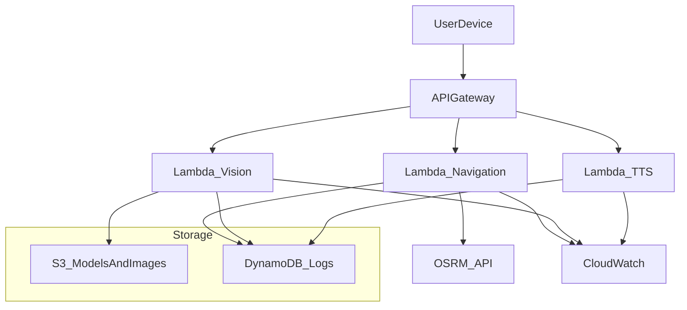
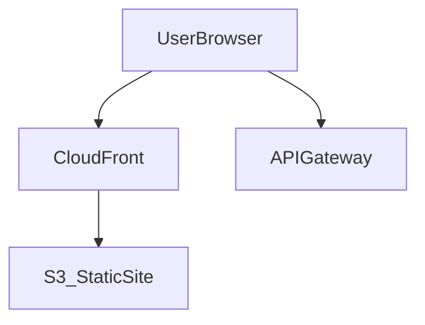

## AWS Deployment PRD — Serverless, Low-Cost Architecture

### 1. Purpose & Scope

This document defines the **deployment and infrastructure requirements** for running the *AI-Assisted Navigation System for the Visually Impaired* on **Amazon Web Services (AWS)**.

It should be read together with the main product PRD (`PRD.md`), which defines product goals, user stories, and feature requirements. This AWS deployment PRD focuses on:

- **Infrastructure architecture** (services, topology, environments).
- **Operational requirements** (security, monitoring, reliability).
- **Cost constraints**, with an emphasis on a **mostly serverless, almost-free** deployment under low MVP traffic.

**Cost objective:** Design for an **almost-free** deployment using AWS Free Tier and serverless services where possible, targeting **≤ USD $5/month** under expected MVP traffic and allowing graceful scaling if adoption grows.

---

### 2. High-Level Architecture

#### 2.1 Architectural Overview

The system is deployed using a **serverless-first architecture**:

- **Frontend / Client**
  - A mobile client (Phase 3 from `PRD.md`) or any HTTP(s) client communicates with the backend via REST APIs.
  - Optionally, a minimal static web front-end (status dashboard, developer console) is hosted on **Amazon S3** and served via **Amazon CloudFront**.

- **Backend API**
  - Core public API exposed via **Amazon API Gateway** (HTTP or REST API).
  - **AWS Lambda** functions implement:
    - Navigation logic (wrapping `navigation_service.py`).
    - Obstacle inference (wrapping `vision_service.py`), where feasible.
    - Text-to-speech integration (wrapping `voice_service.py` or future Polly integration).

- **Model & Data Storage**
  - **Amazon S3** bucket(s) hold:
    - ML models such as `yolo12n.pt` and future trained weights (`best.pt`).
    - Temporary image uploads (if used by clients).
    - Optional static site assets.
  - **Amazon DynamoDB** (or S3 logs) store:
    - Minimal structured data (usage logs, anonymized telemetry, error events).
    - Configuration or feature flags if needed.

- **Monitoring & Cost Control**
  - **Amazon CloudWatch** for logs, metrics, and alarms.
  - **AWS Budgets** and billing alerts to cap monthly spend.

#### 2.2 Architecture Diagram

If a static web front-end is introduced:

---

### 3. Functional Requirements (Infrastructure)

The AWS deployment must provide the following **infrastructure-level** capabilities.

- **FR-AWS-1: Secure HTTPS API Exposure**
  - Expose all required backend features (detection, navigation, text-to-speech) via **HTTPS** endpoints.
  - Use **API Gateway** as the single entry point; no direct Lambda or S3 public endpoints for sensitive operations.

- **FR-AWS-2: Image / Sensor Data Handling**
  - Support ingestion of images or encoded frames from clients using **API Gateway + Lambda**.
  - Optionally support direct client upload to S3 via pre-signed URLs to reduce Lambda payload sizes.

- **FR-AWS-3: Model Loading and Execution**
  - Enable Lambda functions (or future container-based compute) to load ML models from S3 at startup or on first invocation.
  - Ensure that the deployment package or alternative mechanisms (e.g. Lambda Layers, EFS, or reduced model size) respect Lambda limits.

- **FR-AWS-4: Navigation Computation**
  - Provide a stateless navigation endpoint that wraps the existing `navigation_service.py` and communicates with OSRM or similar routing APIs.
  - API must return JSON instructions compatible with the formats defined in `PRD.md`.

- **FR-AWS-5: Speech Output Integration**
  - Provide an endpoint to convert text responses (navigation steps, obstacle alerts) into audio streams or URLs that the client can play.
  - Initially may proxy to existing local TTS via Lambda-compatible library; later can migrate to Amazon Polly with minimal API changes.

- **FR-AWS-6: Health, Logging, and Metrics**
  - Provide basic health check endpoints (e.g., `/health`) to verify API liveness.
  - Emit structured logs and metrics to **CloudWatch** for all Lambda functions and API Gateway.

- **FR-AWS-7: Versioned Deployments**
  - Allow deploying new application and model versions without downtime by:
    - Using **Lambda versions and aliases**, or
    - Separate “staging” stage in API Gateway.

---

### 4. Non-Functional Requirements (Cost, Performance, Reliability)

#### 4.1 Cost

- **NFR-C1 (Free-Tier-First Design)**  
  Use AWS Free Tier–eligible services wherever possible:
  - Lambda (1M free requests/month).
  - API Gateway (up to 1M REST API calls/month in free tier depending on account age).
  - S3 (5GB storage, 20k GET, 2k PUT).
  - DynamoDB (25 GB storage, free RCUs/WCUs in some tiers).

- **NFR-C2 (Cost Target)**  
  - Target average monthly infrastructure cost **≤ USD $5** under MVP traffic:
    - Low daily active users (e.g., ≤ 20) with limited sessions.
    - Modest image/frame processing volume (e.g., <= a few thousand requests/day).

- **NFR-C3 (Budgets and Alerts)**  
  - Configure **AWS Budgets** with:
    - Monthly budget threshold at **USD $5**.
    - Alert at **50%**, **80%**, and **100%** of budget via email.

- **NFR-C4 (Guardrails)**  
  - Rate-limit API usage through API Gateway usage plans (per API key) to avoid accidental high costs.
  - Use lifecycle policies on S3 for temporary objects (e.g., delete images after 24 hours).

#### 4.2 Performance

- **NFR-P1 (API Latency)**  
  - Target median end-to-end API latency for navigation and detection endpoints **≤ 1 second** under typical load.
  - Cold-start spikes (for Lambdas invoked infrequently) are acceptable up to **3–4 seconds** during MVP.

- **NFR-P2 (Throughput)**  
  - System should comfortably handle **10 concurrent users** sending moderate-frequency requests (e.g., 1–2 detections/second each) within cost constraints.

- **NFR-P3 (Scalability)**  
  - Scaling should be primarily automatic via serverless concurrency; no manual capacity planning for early phases.

#### 4.3 Reliability & Availability

- **NFR-R1 (Stateless Compute)**  
  - All Lambdas must be stateless; any state is externalized to S3 or DynamoDB.

- **NFR-R2 (Availability Target)**  
  - For MVP: aim for **99.5%** API availability; production target (future) **99.9%**.

- **NFR-R3 (Graceful Degradation)**  
  - In case of model load failure or external API issues (e.g., OSRM down), return clear error messages and allow clients to inform users appropriately.

---

### 5. Service-by-Service AWS Design

#### 5.1 Amazon API Gateway

- **Role**
  - Public HTTPS entry point for all clients (mobile app, test tools).
  - Routes requests to Lambda functions using HTTP or REST API integration.

- **Key Endpoints**
  - `POST /detect` — Image or frame-based obstacle detection.
  - `GET /navigate` — Turn-by-turn navigation instructions based on coordinates.
  - `POST /speak` — Text-to-speech endpoint.
  - `GET /health` — Basic health check.

- **Configuration Highlights**
  - Prefer **HTTP API** for reduced cost unless a specific REST API feature is required.
  - Enable **CORS** where needed (for web-based tools).
  - Configure **usage plans and API keys** for non-public environments (dev/test).

- **Cost Considerations**
  - Choose the cheaper API Gateway flavor (HTTP API) where functionality suffices.
  - Use request throttling and quotas per API key.

#### 5.2 AWS Lambda Functions

- **Role**
  - Compute layer for navigation, detection, and text-to-speech orchestration.

- **Functions**
  - `lambda-navigation`:
    - Wraps `navigation_service.py`.
    - Inputs: origin/destination coordinates.
    - Calls OSRM or equivalent routing API.
  - `lambda-vision`:
    - Wraps `vision_service.py`.
    - Inputs: image (base64, multipart) or S3 URI.
    - Performs YOLO inference and spatial analysis.
  - `lambda-tts`:
    - Converts text to audio:
      - Initially via Python TTS library compatible with Lambda.
      - Future: integrate Amazon Polly using SDK calls.

- **Configuration Highlights**
  - **Memory**:
    - Start with 1–2 GB for `lambda-vision` (to handle model loading).
    - 256–512 MB for navigation and TTS functions.
  - **Timeouts**:
    - Vision: up to 15–20 seconds maximum; target < 2 seconds typical.
    - Navigation and TTS: 5–10 seconds max, target < 1 second typical.
  - **Packaging**:
    - Use minimal, slim dependencies (reuse local `requirements.txt` but trim unused packages).
    - Consider **Lambda Layers** for shared dependencies (e.g., PyTorch/ONNX, OpenCV) if needed.
    - If the full model stack exceeds Lambda limits, plan for model size optimization or an alternate compute option (see Risks).

- **Cost Considerations**
  - Optimize memory and runtime to keep **GB-seconds** within free tier where possible.
  - Use **provisioned concurrency** sparingly (only if cold starts are unacceptable and traffic justifies extra cost).

#### 5.3 Amazon S3 Buckets

- **Role**
  - Central storage for models, temporary uploads, and optional static web assets.

- **Buckets**
  - `navigation-aid-models`:
    - Stores ML model files, e.g. `yolo12n.pt`, `best.pt`.
    - Versioning enabled for rollback.
  - `navigation-aid-uploads`:
    - Stores user images or frames temporarily (if using S3 upload flow).
    - Lifecycle rule: delete objects after **24 hours**.
  - `navigation-aid-static-site` (optional):
    - Hosts a minimal static web console or documentation site.

- **Security & Access**
  - Block all public access on model and uploads buckets.
  - Grant access to Lambdas via IAM roles with least-privilege permissions.

- **Cost Considerations**
  - Keep model artifacts size reasonable (tens of MB rather than hundreds).
  - Use lifecycle rules to automatically remove temporary data and older model versions where appropriate.

#### 5.4 DynamoDB / S3 for Data

- **Role**
  - Persist lightweight structured data for analytics and debugging while avoiding complex/expensive relational databases.

- **Design**
  - Single table `NavigationAidEvents` (DynamoDB):
    - Partition key: `userId` or `deviceId` (if anonymous, a generated ID).
    - Sort key: `timestamp`.
    - Attributes: `eventType` (e.g. DETECTION, NAVIGATION_STEP, ERROR), `payloadSummary`.
  - Optionally, batch export logs to S3 for longer-term storage and offline analysis.

- **Cost Considerations**
  - Start with **on-demand capacity mode** for simplicity; switch to provisioned with a low baseline once usage is understood.
  - Rely on Free Tier (up to 25 GB storage and baseline RCUs/WCUs depending on account).

#### 5.5 CloudFront (Optional)

- **Role**
  - Content Delivery Network (CDN) in front of S3 static assets to improve performance for any web-based front-end and reduce S3 request costs at scale.

- **Configuration Highlights**
  - Origin: `navigation-aid-static-site` S3 bucket.
  - Default TTL for static files (e.g. 1 hour–1 day, depending on update frequency).
  - HTTPS-only distribution.

- **Cost Considerations**
  - Initially optional; enable only if a static front-end or high geographic distribution justifies the added cost.

#### 5.6 Authentication & Authorization

- **Approach (MVP)**
  - For early internal/dev use, protect APIs via:
    - API keys and usage plans in API Gateway, and/or
    - Simple bearer tokens issued out-of-band.

- **Future Option**
  - Integrate **Amazon Cognito** user pools for proper user identity and token-based access control.

- **Requirements**
  - No unauthenticated write access to detection, navigation, or TTS endpoints in production.
  - Ensure secure storage of any secrets (e.g. OSRM API keys if using a hosted provider) via **AWS Systems Manager Parameter Store** or **AWS Secrets Manager**.

---

### 6. Deployment & Environments

#### 6.1 Environments

- **Development (dev)**
  - Used by developers for integration testing.
  - Separate API Gateway stage: `dev`.
  - Separate S3 prefixes or buckets (`-dev`) to avoid mixing data.

- **Production (prod)**
  - User-facing environment.
  - API Gateway stage: `prod`.
  - Strict IAM roles and tighter throttling/quotas.

#### 6.2 Infrastructure as Code (IaC)

- **Preferred Options**
  - **AWS SAM** (Serverless Application Model) for defining Lambdas, API Gateway, and related resources using templates.
  - Alternative: **Serverless Framework** or **Terraform** if the team is more familiar with them.

- **Requirements**
  - All production infrastructure must be definable and reproducible via IaC templates.
  - Single command (e.g., `sam deploy --config-file ...`) should deploy or update the stack for a given environment.

#### 6.3 CI/CD

- **Pipeline**
  - Use GitHub Actions (or similar CI) to:
    - Run tests (unit tests for Python services).
    - Package Lambda functions.
    - Deploy via SAM/CloudFormation to `dev`, then `prod` upon approval.

- **Promotion Strategy**
  - Change flow:
    - Merge to `main` branch → deploy to `dev`.
    - Manual approval → deploy to `prod`.

#### 6.4 Rollout Strategy

- **Lambda Versions and Aliases**
  - Use Lambda aliases (`prod`, `dev`) to point to specific versions.
  - Deploy new versions in parallel, shift traffic by updating the alias.

---

### 7. Security & Compliance

- **IAM and Least Privilege**
  - Each Lambda function receives its own IAM role with:
    - Read-only access to the relevant S3 buckets (models, uploads).
    - Write access only to required DynamoDB tables and CloudWatch logs.

- **Data Protection**
  - Enforce HTTPS/TLS 1.2+ for all API Gateway endpoints.
  - Enable encryption at rest:
    - S3 buckets with SSE-S3 (or SSE-KMS if needed).
    - DynamoDB with default encryption.

- **Network Security**
  - Initial MVP may rely entirely on public endpoints (no VPC) to keep architecture simple and cheap.
  - If a VPC is introduced later (e.g. for EFS or private routing), ensure NAT usage is minimized to avoid unnecessary cost.

- **Privacy**
  - Do not store personally identifiable information (PII) beyond what is strictly necessary.
  - Temporary images stored in S3 uploads bucket must be auto-deleted via lifecycle rules.

---

### 8. Monitoring, Logging, and Alerts

- **Logging**
  - All Lambda functions write structured logs (JSON where possible) to **CloudWatch Logs**.
  - Include correlation IDs per request for end-to-end tracing (e.g., `requestId`).

- **Metrics**
  - Track standard and custom metrics:
    - Invocation count, error count, and duration per Lambda.
    - API Gateway 4xx/5xx error counts and latency.
    - Application-level metrics (e.g., route computation time, detection latency).

- **Dashboards & Alarms**
  - Create a **CloudWatch dashboard** summarizing:
    - Lambda error rates and durations.
    - API Gateway latency and error metrics.
  - Configure alarms to:
    - Notify on sustained 5xx error rate > 5% for 5 minutes.
    - Notify on p95 latency > 2 seconds for detection or navigation endpoints.
    - Notify on billing anomalies via AWS Budgets.

---

### 9. Cost Model & Limits

#### 9.1 Approximate Cost Drivers (MVP Scale)

- **API Gateway**
  - Cost per million requests; mostly within Free Tier for low traffic.
- **Lambda**
  - Billed by GB-second; depends on function memory and execution time.
- **S3**
  - Storage cost per GB per month plus PUT/GET requests.
- **DynamoDB**
  - On-demand read/write units and storage (largely free-tier at small scale).

#### 9.2 Example MVP Scenario (Illustrative)

Assume:

- 20 daily active users.
- Each user performs 10 navigation steps and 200 detection calls per session.
- Session length: 30–60 minutes.

This yields on the order of:

- ~4,000 detection API calls/day.
- ~200 navigation API calls/day.
- ~Several thousand `/speak` calls/day if every detection and navigation step is voiced.

Under these volumes and with careful Lambda memory/time tuning, the system should:

- Largely remain within or near the **AWS Free Tier** for an initial 12 months.
- Fit within the **USD $5/month** target for ongoing usage, assuming no extreme spikes.

#### 9.3 Hard Limits and Guardrails

- API Gateway:
  - Apply per-API key throttling (e.g., 10 requests/second, burst 20) and daily quotas.
- S3:
  - Enforce lifecycle policies:
    - Temporary uploads: delete after 24 hours.
    - Logs: transition to infrequent access or Glacier after 30–90 days if needed.
- DynamoDB:
  - Start with on-demand; if needed, cap provisioned capacity at a conservative baseline and monitor usage.

---

### 10. Risks & Open Questions

- **R1: Lambda Size and Model Constraints**
  - Risk that full YOLO model and dependencies exceed Lambda size or memory limits, or cause unacceptable cold-start times.
  - Mitigation:
    - Explore model compression or smaller variants.
    - Use Lambda Layers or EFS if necessary.
    - As a fallback, move vision inference to a small EC2 instance or Fargate service while keeping navigation and TTS serverless.

- **R2: Cold-Start Latency**
  - ML-heavy Lambdas may suffer from high cold-start latencies.
  - Mitigation:
    - Keep functions warm with occasional scheduled invocations if needed.
    - Consider provisioned concurrency once traffic stabilizes (with careful cost monitoring).

- **R3: External Routing API Dependency**
  - OSRM or chosen routing API might have downtime or rate limits.
  - Mitigation:
    - Implement retries and fallbacks.
    - Cache recent routes in DynamoDB/S3.

- **R4: Cost Overruns Due to Unexpected Traffic**
  - Viral or automated usage could drive high API and Lambda costs.
  - Mitigation:
    - Strict usage plans and throttling.
    - AWS Budgets with low thresholds and near-real-time alerts.

- **R5: Security Misconfiguration**
  - Misconfigured S3 buckets or IAM roles could expose sensitive data.
  - Mitigation:
    - Use AWS security checks (e.g., Security Hub, S3 Block Public Access).
    - Review IAM policies as part of code review.

---

### 11. Integration With Main PRD

- This `PRD-AWS.md` is **deployment-focused** and should be maintained alongside `PRD.md`.
- All feature requirements, user stories, and success metrics remain defined in `PRD.md`.
- Any changes to API shapes (e.g., detection or navigation response formats) must be reflected:
  - In the main PRD’s API sections (Phase 2).
  - In the corresponding Lambda implementations and API Gateway schemas.

