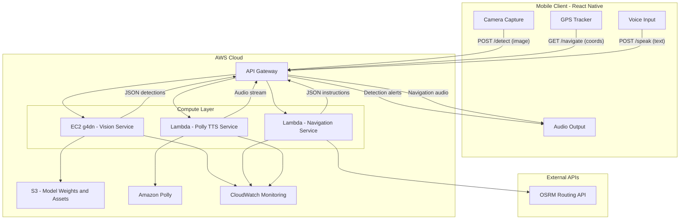
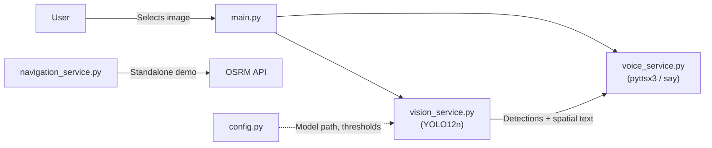
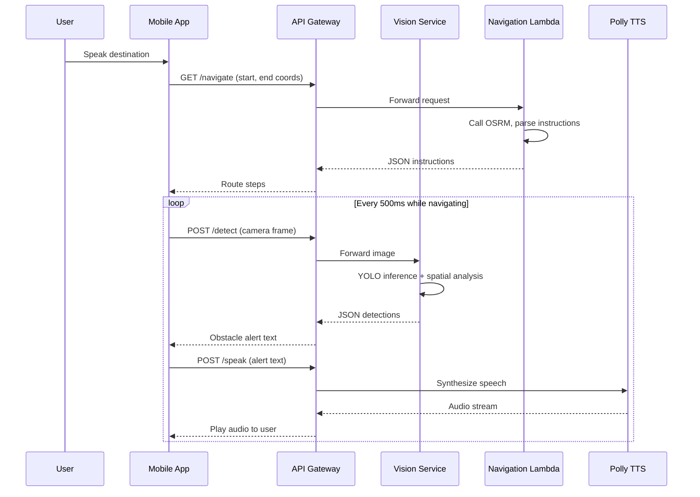

# Product Requirements Document (PRD)

## AI-Assisted Navigation System for the Visually Impaired

**Project**: Group 11 Capstone
**Version**: 1.0
**Last Updated**: March 2026

---

## 1. Product Overview

### 1.1 Problem Statement

Australia has approximately 575,000 people living with vision impairment (Vision 2020 Australia). Navigating open urban environments poses significant challenges and safety risks for these individuals, including collision with obstacles, inability to read traffic signals, and difficulty following pedestrian routes without sighted assistance.

### 1.2 Product Vision

Develop an AI-powered system deployed on a user's smartphone, connected to a cloud computing platform, that enables blind and visually impaired users to navigate urban environments safely and independently. The system allows users to input a starting address and a desired destination, then provides step-by-step walking instructions while simultaneously detecting and announcing obstacles and hazards in real time.

### 1.3 Target Users

- **Primary**: Blind and low-vision individuals navigating urban pedestrian environments (footpaths, crossings, transit stops).
- **Secondary**: Caregivers and orientation & mobility specialists who assist visually impaired individuals with route planning.

### 1.4 Key Capabilities

| Capability | Description |
|---|---|
| Obstacle Detection | Identify urban hazards (vehicles, potholes, barriers, stairs) using computer vision |
| Spatial Awareness | Translate detected objects into spoken spatial descriptions (position + distance) |
| Turn-by-Turn Navigation | Provide walking directions from origin to destination |
| Audio Feedback | Deliver all guidance as spoken audio, hands-free |

---

## 2. Current State Assessment

### 2.1 What Has Been Built

The local prototype consists of five Python modules with the following capabilities:

| Module | Status | Description |
|---|---|---|
| `config.py` | Done | Central configuration for model path, confidence threshold (0.4), and 11 COCO target class IDs |
| `vision_service.py` | Done | YOLO12n model loading, inference on single images, spatial analysis (left/right/ahead, distance estimation via bounding box height) |
| `navigation_service.py` | Done | OSRM public API integration for walking directions, raw maneuver-to-English translation, standalone demo with hardcoded UOW Library to North Wollongong Station coordinates |
| `voice_service.py` | Done | Cross-platform TTS using macOS native `say` command and Windows `pyttsx3` |
| `main.py` | Done | Desktop GUI loop using Tkinter file dialog for image selection, OpenCV display with bounding box overlays, voice output of detection results |

### 2.2 Available Dataset

A Roboflow dataset (`img/Visually impaired dataset.v2i.yolov12/`) is present in the repository but **not yet used for training**:

- **Source**: Roboflow Universe (CC BY 4.0 license)
- **Classes**: 30 domain-specific categories including: `pothole`, `zebra crossing`, `barrier`, `stairs`, `traffic signal`, `electric pole`, `footpath`, `gate`, `pillar`, `stones`, and others
- **Split**: Train 2,523 images | Validation 515 images | Test 287 images
- **Format**: YOLO annotation format with `data.yaml`

### 2.3 Gaps and Limitations

| Gap | Detail |
|---|---|
| No custom-trained model | The system uses a pre-trained YOLO12n on generic COCO classes rather than the 30 domain-specific classes in the dataset |
| Static image input only | Detection runs on individual images selected via file dialog; no video or camera feed support |
| Vision and navigation are disconnected | `main.py` only uses the vision service; navigation is a standalone script with no user-facing integration |
| Single-object reporting | Spatial analysis only reports the closest/largest object; other detections are summarised as a count |
| No dependency management | No `requirements.txt` or `pyproject.toml`; manual pip install required |
| No cloud infrastructure | All processing is local; no Docker, no AWS services |
| No mobile client | Desktop-only via Tkinter |

---

## 3. Feature Requirements — Phase 1: Local Prototype Enhancement

**Goal**: Complete the local prototype so it functions as a fully integrated proof-of-concept before cloud migration.

### FR1.1 Custom Model Training

| Field | Detail |
|---|---|
| **Priority** | High |
| **Description** | Fine-tune YOLO12 on the Roboflow "Visually impaired dataset v2" (30 classes) to detect domain-specific obstacles such as potholes, zebra crossings, barriers, stairs, and electric poles |
| **Input** | `img/Visually impaired dataset.v2i.yolov12/data.yaml` (2,523 train / 515 val / 287 test images) |
| **Output** | A trained model weights file (e.g., `best.pt`) with evaluation metrics (mAP@0.5, precision, recall) |
| **Acceptance Criteria** | mAP@0.5 >= 0.60 on the test split; `config.py` updated to reference the new model and 30 class IDs |

### FR1.2 Real-Time Video / Webcam Support

| Field | Detail |
|---|---|
| **Priority** | High |
| **Description** | Replace the Tkinter file dialog with OpenCV `VideoCapture` to process a live webcam feed or video file, running detection frame-by-frame |
| **Acceptance Criteria** | System processes webcam feed at >= 10 FPS on a machine with a mid-range GPU; audio alerts are throttled to avoid overlapping speech |

### FR1.3 Unified Vision + Navigation Workflow

| Field | Detail |
|---|---|
| **Priority** | Medium |
| **Description** | Integrate `navigation_service.py` into `main.py` so the user can input start/end coordinates (or addresses via geocoding) and receive turn-by-turn walking instructions spoken aloud, while obstacle detection runs concurrently on the camera feed |
| **Acceptance Criteria** | A single entry point (`python main.py`) launches both navigation guidance and obstacle detection; navigation instructions are spoken at each waypoint; obstacle alerts interrupt or queue after navigation prompts |

### FR1.4 Dependency Management

| Field | Detail |
|---|---|
| **Priority** | High |
| **Description** | Add a `requirements.txt` with pinned dependency versions derived from the working virtual environment |
| **Acceptance Criteria** | A clean `pip install -r requirements.txt` in a fresh venv reproduces the working environment without errors |

### FR1.5 Multi-Object Reporting

| Field | Detail |
|---|---|
| **Priority** | Low |
| **Description** | Enhance `analyze_scene()` in `vision_service.py` to report up to 3 objects with position and distance, prioritised by proximity and hazard severity |
| **Acceptance Criteria** | When 3 objects are detected, audio output describes each (e.g., "Car ahead, nearby. Person on the left. Bicycle on the right.") |

---

## 4. Feature Requirements — Phase 2: AWS Cloud Deployment

**Goal**: Migrate the validated local logic to AWS so that processing happens server-side and results are delivered to any connected client over HTTPS.

### FR2.0 AWS Model Deployment Tasks (Low-Cost Lambda / Free-Tier Focus)

| Field | Detail |
|---|---|
| **Priority** | High |
| **Description** | Deploy the trained vision model to AWS **only using AWS Lambda** (no EC2/Fargate), targeting Free Tier or near-zero monthly cost. |
| **Tasks** | 1) Prepare the trained YOLO model (`best.pt` or equivalent) in a Lambda-ready format and validate accuracy/size. 2) Wrap `vision_service.py` in a simple `/detect` Lambda handler that accepts an image and returns JSON detections. 3) Package code, dependencies, and model using Lambda deployment best practices (e.g., Layers or S3-hosted model file loaded at init) and verify the bundle fits Lambda size/memory/time limits. 4) Create an S3 bucket for model artifacts and optional temporary image uploads, with lifecycle rules to delete uploads after 24 hours. 5) Put API Gateway in front of the Lambda with a `POST /detect` endpoint, basic authentication (API key) and throttling. 6) Configure AWS Budgets and CloudWatch metrics/alarms so usage remains within Free Tier or ≈USD $5/month at MVP traffic. 7) Load test a small number of concurrent users to confirm latency, cold-start behaviour, and error rates are acceptable. |
| **Acceptance Criteria** | A deployed `/detect` **Lambda** endpoint on AWS that: (a) returns correct JSON detections for test images, (b) keeps average inference latency and cold-start behaviour within the latency targets in Section 6, and (c) remains within Free Tier or ≈USD $5/month under expected MVP traffic profile. |

### FR2.1 Containerise Vision Service

| Field | Detail |
|---|---|
| **Priority** | High |
| **Description** | Create a `Dockerfile` that packages `vision_service.py`, the trained model weights, and all dependencies into a container image. Deploy to an AWS EC2 `g4dn.xlarge` instance (NVIDIA T4 GPU) for inference, or optimise for AWS Lambda with a smaller model variant |
| **Acceptance Criteria** | Container builds and runs locally with `docker build` / `docker run`; inference latency < 500ms per image on the target instance |

### FR2.2 Navigation Lambda Microservice

| Field | Detail |
|---|---|
| **Priority** | High |
| **Description** | Deploy `navigation_service.py` as an AWS Lambda function behind API Gateway. The function accepts origin/destination coordinates and returns JSON instructions |
| **Acceptance Criteria** | Lambda cold-start latency < 3 seconds; warm invocation < 200ms; returns valid JSON matching the current instruction format |

### FR2.3 Amazon Polly TTS Integration

| Field | Detail |
|---|---|
| **Priority** | Medium |
| **Description** | Replace the local `voice_service.py` TTS engine with Amazon Polly API calls. Use Polly's Neural engine (e.g., voice "Olivia" for Australian English) to generate MP3 audio streams returned to the client |
| **Acceptance Criteria** | Audio is generated in < 1 second for sentences up to 200 characters; output is a streamable MP3 or OGG file |

### FR2.4 REST API via API Gateway

| Field | Detail |
|---|---|
| **Priority** | High |
| **Description** | Create an AWS API Gateway with the following endpoints: |

| Endpoint | Method | Request | Response |
|---|---|---|---|
| `/detect` | POST | Image (base64 or multipart) | JSON array of detections with spatial descriptions |
| `/navigate` | GET | `start_lat`, `start_lon`, `end_lat`, `end_lon` | JSON array of spoken instructions |
| `/speak` | POST | `text` | Audio file (MP3) via Amazon Polly |

| Field | Detail |
|---|---|
| **Acceptance Criteria** | All endpoints return correct responses with < 2 second total round-trip; API key or Cognito authentication enforced |

### FR2.5 S3 Storage

| Field | Detail |
|---|---|
| **Priority** | Medium |
| **Description** | Use an S3 bucket for model weight storage (loaded by EC2/Lambda at startup) and temporary image uploads from the mobile client |
| **Acceptance Criteria** | Model weights are fetched from S3 on container start; uploaded images are auto-deleted after 24 hours via lifecycle policy |

### FR2.6 Monitoring and Logging

| Field | Detail |
|---|---|
| **Priority** | Low |
| **Description** | Configure AWS CloudWatch for Lambda/EC2 logs, API Gateway access logs, and custom metrics (inference latency, error rate, request count) |
| **Acceptance Criteria** | A CloudWatch dashboard displays real-time metrics; alarms trigger on error rate > 5% or latency > 2 seconds |

---

## 5. Feature Requirements — Phase 3: Mobile Client

**Goal**: Build a lightweight smartphone application that captures images, tracks location, and communicates with the AWS backend to deliver audio navigation and obstacle alerts.

### FR3.1 React Native Application

| Field | Detail |
|---|---|
| **Priority** | High |
| **Description** | Build a cross-platform mobile app (iOS + Android) using React Native. The app serves as the primary user interface for the navigation system |
| **Acceptance Criteria** | App builds and runs on both iOS (>= 15) and Android (>= 12); passes basic accessibility audit |

### FR3.2 Start / Destination Input

| Field | Detail |
|---|---|
| **Priority** | High |
| **Description** | Provide a voice-driven and text-based interface for entering start and destination addresses, with autocomplete powered by a geocoding API (e.g., Nominatim or Google Places) |
| **Acceptance Criteria** | User can speak a destination and confirm via voice; typed input shows autocomplete suggestions within 500ms |

### FR3.3 Real-Time Obstacle Alerts

| Field | Detail |
|---|---|
| **Priority** | High |
| **Description** | The app captures camera frames at a configurable interval (e.g., every 500ms), sends them to the `/detect` endpoint, and plays the returned spatial audio alert through the phone speaker or Bluetooth earpiece |
| **Acceptance Criteria** | Obstacle alerts are delivered within 2 seconds of frame capture (including network round-trip); alerts do not overlap with navigation instructions |

### FR3.4 Accessibility-First UI

| Field | Detail |
|---|---|
| **Priority** | High |
| **Description** | Design the entire UI for non-visual interaction: full VoiceOver (iOS) and TalkBack (Android) support, large touch targets (>= 48dp), haptic feedback for confirmations, high-contrast mode, and minimal visual clutter |
| **Acceptance Criteria** | A visually impaired user can complete the full workflow (input destination, start navigation, receive alerts, arrive) using only voice and touch without sighted assistance |

### FR3.5 Offline Fallback Mode

| Field | Detail |
|---|---|
| **Priority** | Low |
| **Description** | Cache the most recent route instructions locally. Optionally bundle a lightweight on-device YOLO model (e.g., via TensorFlow Lite or CoreML) so basic obstacle detection continues when the network is unavailable |
| **Acceptance Criteria** | Cached route instructions remain accessible for 24 hours after download; on-device detection achieves >= 5 FPS on a mid-range phone |

---

## 6. Non-Functional Requirements

| ID | Category | Requirement |
|---|---|---|
| NFR-1 | **Latency** | Obstacle detection end-to-end response (frame capture to audio playback) < 2 seconds over 4G; server-side inference < 500ms |
| NFR-2 | **Availability** | Cloud services maintain 99.9% uptime (< 8.76 hours downtime per year) |
| NFR-3 | **Accessibility** | Mobile app complies with WCAG 2.1 Level AA; all interactive elements are screen-reader compatible |
| NFR-4 | **Security** | All client-server communication over HTTPS/TLS 1.2+; uploaded images are not stored beyond processing; no PII collected |
| NFR-5 | **Scalability** | EC2 auto-scaling group handles up to 100 concurrent users; Lambda concurrency set to 500 |
| NFR-6 | **Battery** | Mobile app camera + GPS usage should not drain a typical phone battery (4,000 mAh) below 50% within 1 hour of continuous use |
| NFR-7 | **Model Size** | Cloud model (YOLO12) < 50 MB; on-device fallback model < 10 MB |

---

## 7. Technical Architecture

### 7.1 System Architecture Diagram



### 7.2 Local Prototype Architecture (Current)



### 7.3 Data Flow



---

## 8. Success Metrics

| Metric | Target | Measurement Method |
|---|---|---|
| **Detection Accuracy (mAP@0.5)** | >= 0.60 on custom dataset test split | Automated evaluation after model training |
| **End-to-End Latency** | < 2 seconds (frame capture to audio) | Instrumented timing in mobile app |
| **Server Inference Latency** | < 500ms per image | CloudWatch custom metric |
| **Navigation Instruction Accuracy** | 95% of instructions match expected route | Manual comparison against known routes |
| **User Satisfaction (SUS Score)** | >= 70 (above average) | System Usability Scale survey with target users |
| **Navigation Completion Rate** | >= 80% of test routes completed | User testing sessions |
| **Mobile Battery Impact** | < 50% drain in 1 hour continuous use | Battery monitoring during field tests |

---

## 9. Risks and Mitigations

| Risk | Impact | Likelihood | Mitigation |
|---|---|---|---|
| **Poor detection in low light / rain** | High | Medium | Augment training data with low-light and weather variations; add confidence-aware fallback ("Caution: visibility is limited") |
| **OSRM public API rate limits or downtime** | Medium | Medium | Cache recent routes locally; evaluate self-hosting OSRM or switching to a commercial API (Google, Mapbox) for production |
| **High mobile battery drain** | Medium | High | Make frame capture interval configurable (500ms to 2s); allow manual pause of detection; optimise image resolution sent to backend |
| **Network latency or disconnection** | High | Medium | Implement offline fallback (FR3.5) with cached routes and on-device lightweight model |
| **Model accuracy on unseen environments** | High | Medium | Continuously expand training dataset with real-world images from Australian cities; implement user feedback loop for false detections |
| **Accessibility regression** | High | Low | Include automated accessibility tests in CI/CD; conduct regular testing with visually impaired users |
| **AWS cost overrun** | Medium | Medium | Set billing alerts; use spot instances for non-critical workloads; right-size EC2 instances based on actual traffic |

---

## 10. Appendix

### A. Dataset Class List (30 Classes)

| # | Class Name | # | Class Name |
|---|---|---|---|
| 0 | Dog | 15 | Fridge |
| 1 | Door | 16 | Gate |
| 2 | Table | 17 | Motorcycle |
| 3 | Auto | 18 | Pothole |
| 4 | Barrier | 19 | Person |
| 5 | Bench | 20 | Pillar |
| 6 | Bicycle | 21 | Plant |
| 7 | Bus | 22 | Sign board |
| 8 | Car | 23 | Stairs |
| 9 | Cattle | 24 | Step |
| 10 | Chair | 25 | Stones |
| 11 | Dustbin | 26 | Traffic signal |
| 12 | Electric pole | 27 | Tree |
| 13 | Footpath | 28 | Truck |
| 14 | Fridge | 29 | Wash basin |
|  |  | 30 | Zebra crossing |

### B. Current COCO Target Classes (config.py)

Person (0), Bicycle (1), Car (2), Motorcycle (3), Bus (5), Truck (7), Traffic Light (9), Stop Sign (11), Bench (13), Cat (15), Dog (16)

### C. Repository Structure

```
helping-group-11/
├── config.py                  # Model path, thresholds, class IDs
├── main.py                    # Application entry point (Tkinter GUI)
├── vision_service.py          # YOLO12 detection + spatial analysis
├── navigation_service.py      # OSRM routing + instruction parsing
├── voice_service.py           # Cross-platform TTS
├── yolo12n.pt                 # Pre-trained model weights
├── README.md                  # Project documentation
├── PRD.md                     # This document
└── img/
    └── Visually impaired dataset.v2i.yolov12/
        ├── data.yaml          # Dataset configuration
        ├── train/             # 2,523 training images + labels
        ├── valid/             # 515 validation images + labels
        └── test/              # 287 test images + labels
```
