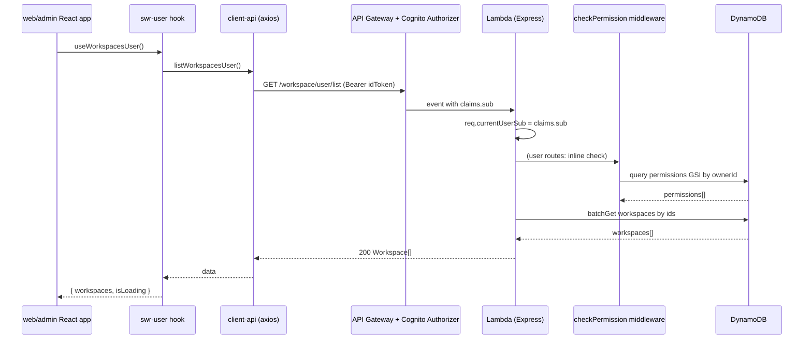

# Workspace & Permission API — Implementation Plan

## 0. What's already in place vs. what we're adding

Current state ([apps/api/src](apps/api/src), [packages/types](packages/types), [packages/client-api](packages/client-api)):
- One DynamoDB table (`admin`); Cognito authorizer; `isAdmin` middleware; `req.currentUserSub` from claims.
- `@baseline/types` only has `Admin`, `PagedResponse`. `@baseline/client-api` only has `admin.ts` (uses an injected `requestHandler` param).
- `apps/admin` uses Amplify + react-router data loaders + axios. `apps/web` has no auth, no data layer.

Reference at `/Users/khiem/Developing/Baseline Fork copy` provides the full template: see [apps/api/src/baseblocks/permission](../../Baseline%20Fork%20copy/apps/api/src/baseblocks/permission), [apps/api/src/baseblocks/workspace](../../Baseline%20Fork%20copy/apps/api/src/baseblocks/workspace), [packages/swr-user](../../Baseline%20Fork%20copy/packages/swr-user).

Key adaptations from the reference:
- Reference uses CDK; we keep `serverless.yml` for tables/functions.
- Reference uses `req.currentUserId` (Cognito `custom:userId` with `sub` fallback); we keep the existing `req.currentUserSub` to avoid touching auth.
- Reference uses `packages/types`; we use `packages/types`.
- Reference's client uses singleton `getRequestHandler()`; we mirror that for new modules so SWR hooks can call them directly (existing `packages/client-api/request-handler.ts` already exports the singleton).

---

## 1. Backend — `apps/api`

### 1a. DynamoDB tables (new files)

Create `src/baseblocks/permission/permission-dynamodb.yml`:

```yaml
Resources:
  permissionTable:
    Type: AWS::DynamoDB::Table
    DeletionPolicy: ${self:custom.deletionPolicy.${opt:stage}}
    UpdateReplacePolicy: ${self:custom.updatePolicy.${opt:stage}}
    Properties:
      TableName: ${env:APP_NAME}-${opt:stage}-permission
      AttributeDefinitions:
        - { AttributeName: permissionId, AttributeType: S }
        - { AttributeName: ownerId,      AttributeType: S }
        - { AttributeName: type,         AttributeType: S }
        - { AttributeName: compositeKey, AttributeType: S }
      KeySchema:
        - { AttributeName: permissionId, KeyType: HASH }
      GlobalSecondaryIndexes:
        - IndexName: ownerId-compositeKey-index
          KeySchema:
            - { AttributeName: ownerId,      KeyType: HASH }
            - { AttributeName: compositeKey, KeyType: RANGE }
          Projection: { ProjectionType: ALL }
        - IndexName: type-compositeKey-index
          KeySchema:
            - { AttributeName: type,         KeyType: HASH }
            - { AttributeName: compositeKey, KeyType: RANGE }
          Projection: { ProjectionType: ALL }
      BillingMode: PAY_PER_REQUEST
```

Create `src/baseblocks/workspace/workspace-dynamodb.yml` (single PK `workspaceId`, no GSI, mirrors admin table style).

### 1b. Wire resources, IAM, and functions in [apps/api/serverless.yml](apps/api/serverless.yml)

In `provider.iam.role.statements`, add `${permissionTable.Arn}`, `${workspaceTable.Arn}` (and `/index/*`) alongside the existing `${adminTable.Arn}`.

Append to `resources:`
```yaml
- ${file(./src/baseblocks/permission/permission-dynamodb.yml)}
- ${file(./src/baseblocks/workspace/workspace-dynamodb.yml)}
```

Append to `functions:`
```yaml
- ${file(./src/baseblocks/permission/permission-functions.yml)}
- ${file(./src/baseblocks/workspace/workspace-functions.yml)}
```

Each new functions file mirrors [apps/api/src/baseblocks/admin/admin-functions.yml](apps/api/src/baseblocks/admin/admin-functions.yml) — proxy `/permission` + `/permission/{any+}` and `/workspace` + `/workspace/{any+}` ANY with the Cognito authorizer.

### 1c. Permission middleware (new)

Create `src/middleware/check-permission.ts` modeled on the reference but using `RequestContext` and `req.currentUserSub`:

```ts
import { NextFunction, Response } from 'express';
import { PermissionType } from '@baseline/types/permission';
import { RequestContext } from '../util/request-context.type';
import { checkPermissionForUserSub } from '../baseblocks/permission/permission-utils';

export interface MiddlewarePermissionCheck { type: PermissionType; value?: string }

export const checkPermission =
  (checks: MiddlewarePermissionCheck[]) =>
  async (req: RequestContext, res: Response, next: NextFunction): Promise<void> => {
    if (!req.currentUserSub) { res.status(401).json({ error: 'Unauthorized' }); return; }
    if (!(await checkPermissionForUserSub(req.currentUserSub, checks))) {
      res.status(403).json({ error: 'User does not have permission' }); return;
    }
    next();
  };
```

### 1d. Permission baseblock (new)

Files (full content modeled on the reference, adapted):
- `src/baseblocks/permission/permission.service.ts` — `ServiceObject<Permission>` + `getPermissionsForOwnerId`, `getPermissionsForType` using the two GSIs (uses `[ServiceObject](apps/api/src/util/service-object.ts)`).
- `src/baseblocks/permission/permission-utils.ts` — `compositeKey = type + (value ? '#' + value : '')`; exports `createPermission({ ownerSub, type, value })` and `checkPermissionForUserSub(sub, checks)`.
- `src/baseblocks/permission/permission.ts` — `permissionMapper`.
- `src/baseblocks/permission/permission-admin-api.ts` — Express router with routes (all `superOnly` except `/me`):
  - `GET /permission/admin/me` → permissions for `req.currentUserSub`
  - `GET /permission/admin/list?type=...` (or `/list/:type`) → list by type
  - `GET /permission/admin/owner/:ownerId` → list by owner
  - `GET /permission/admin/:permissionId`
  - `POST /permission/admin` body `{ ownerId, type, value? }`
  - `DELETE /permission/admin/:permissionId`
- `src/baseblocks/permission/permission-api.ts` — `createApp()` + `createAuthenticatedHandler` + `app.use(adminPermissionRouter)` (handler entry).

`superOnly = checkPermission([{ type: 'SUPER' }])`.

### 1e. Workspace baseblock (new)

- `src/baseblocks/workspace/workspace.service.ts` — `ServiceObject<Workspace>` (PK `workspaceId`).
- `src/baseblocks/workspace/workspace.ts` — `workspaceMapper`.
- `src/baseblocks/workspace/workspace-admin-api.ts` — `superOnly` CRUD:
  - `GET /workspace/admin/list`, `GET /workspace/admin/:workspaceId`, `POST /workspace/admin`, `PATCH /workspace/admin`, `DELETE /workspace/admin/:workspaceId`.
- `src/baseblocks/workspace/workspace-user-api.ts` — user-facing flows that filter by the caller's `WORKSPACE` permissions:
  - `GET /workspace/user/list` (batchGet workspaces from caller's `WORKSPACE` permissions)
  - `GET /workspace/user/:workspaceId` (403 if no `WORKSPACE` permission for that id)
  - `POST /workspace/user` (create workspace, then `createPermission({ ownerSub: req.currentUserSub, type: 'WORKSPACE', value: workspaceId })`)
- `src/baseblocks/workspace/workspace-api.ts` — handler entry mounting both routers.

### 1f. Bootstrap a SUPER for local dev

Add a `permission.seed.json` (one row granting `SUPER` to the seed admin's `userSub` from [admin.seed.json](apps/api/src/baseblocks/admin/admin.seed.json)) and register it under `custom.serverless-dynamodb.seed.local.sources` in `serverless.yml`.

---

## 2. Shared packages

### 2a. `packages/types`

Add `.d.ts` files matching reference shapes (use `packages/types/admin.d.ts` style — `.d.ts`, not `.ts`):
- `base-object.d.ts` — `{ createdAt?: string; updatedAt?: string }`
- `workspace.d.ts` — `Workspace { workspaceId; name; description?; imageUrl? }`
- `permission.d.ts` — `SuperPermissions`/`WorkspacePermissions`/`AllPermissions` constants, `PermissionType`, `Permission { permissionId; type; value?; compositeKey; ownerId }`. Note `.d.ts` allows declared values via `declare const`.

Update [packages/types/package.json](packages/types/package.json) `exports` (or rely on path-style imports already used: `@baseline/types/admin`).

### 2b. `packages/client-api`

Add singleton-style modules (matching the reference, since SWR hooks will use them):
- `packages/client-api/workspace.ts` — `listWorkspacesAdmin / getWorkspaceAdmin / createWorkspaceAdmin / updateWorkspaceAdmin / deleteWorkspaceAdmin` plus `listWorkspacesUser / getWorkspaceUser / createWorkspaceUser`. Each uses `getRequestHandler().request<...>(...)` (singleton already exported from [packages/client-api/request-handler.ts](packages/client-api/request-handler.ts)).
- `packages/client-api/permission.ts` — `getPermissionsForCurrentUserAdmin / getAllPermissionForTypeAdmin / createPermissionAdmin / deletePermissionAdmin`.

The existing `admin.ts` (param-style `requestHandler`) is left untouched.

### 2c. New `shared/swr-user` package

Mirror the reference layout:
- `shared/swr-user/package.json` — `name: "@baseline/swr-user"`, depends on `@baseline/client-api`, `@baseline/types`, `swr`.
- `shared/swr-user/workspace.ts` — `useWorkspacesAdmin` (key `workspace/admin/list`), `useWorkspacesUser` (key `workspace/user/list`), `useWorkspaceUser(id)` (key `workspace/user/${id}` | null) plus optimistic helpers `onWorkspaceCreated/Updated/Deleted`.
- `shared/swr-user/permission.ts` — `usePermissionsForType(type)` (key `permission/admin/list?type=${type}`), `usePermissionsForCurrentUser` (key `permission/admin/me`), plus `onPermissionCreated/Deleted`.
- `shared/swr-user/index.ts` — re-exports.
- `tsconfig.json`, `eslint.config.mjs` cloned from `packages/client-api`.

Register the package by extending [pnpm-workspace.yaml](pnpm-workspace.yaml) `packages:` to include `shared/*` (already covers it) and run `pnpm install`.

---

## 3. Admin frontend — `apps/admin`

Add as workspace deps in [apps/admin/package.json](apps/admin/package.json): `@baseline/swr-user: workspace:1.0.0`, `swr: ^2`.

### 3a. Routes & loaders ([apps/admin/src/App.tsx](apps/admin/src/App.tsx))

Add two new protected routes:
- `/workspaces` → `Workspaces` page (admin CRUD on workspaces)
- `/permissions` → `Permissions` page (per-user grant/revoke `SUPER`/`WORKSPACE`)

The existing `protectedLoader` already initializes the request handler with the Cognito `Authorization` header — no change needed; SWR hooks will use that singleton.

Optional refinement: instead of the binary `checkAdmin` call, switch the gate to `getPermissionsForCurrentUserAdmin()` and require a `SUPER` permission (matches the reference's [protectedLoader](../../Baseline%20Fork%20copy/apps/admin/src/App.tsx)). Old `admin` table can stay as a directory of users; the gate is permission-based.

### 3b. New pages

- `src/baseblocks/workspace/pages/Workspaces.tsx` — uses `useWorkspacesAdmin()`, list + create/edit/delete modals, calls `createWorkspaceAdmin/updateWorkspaceAdmin/deleteWorkspaceAdmin` and `onWorkspace*` mutators. Add link in [Sidebar](apps/admin/src/components/sidebar/Sidebar.tsx).
- `src/baseblocks/permission/pages/Permissions.tsx` — uses `usePermissionsForType('SUPER')` and `usePermissionsForType('WORKSPACE')` plus admin user list ([AdminList.tsx](apps/admin/src/baseblocks/admin/components/admin-list/AdminList.tsx)) to pick a target user; calls `createPermissionAdmin / deletePermissionAdmin`. Pattern follows [UsersList.tsx in the reference](../../Baseline%20Fork%20copy/apps/admin/src/baseblocks/cognito-user/components/users-list/UsersList.tsx).

---

## 4. Web frontend — `apps/web`

The web app currently has no auth or data layer. Add:

### 4a. Dependencies in [apps/web/package.json](apps/web/package.json)

`aws-amplify`, `@aws-amplify/ui-react`, `axios`, `swr`, `@baseline/swr-user: workspace:1.0.0` (already has `@baseline/client-api`, `@baseline/types`).

### 4b. Auth bootstrap

- New `src/lib/amplify.ts` — `Amplify.configure({ Auth: { Cognito: { userPoolId, userPoolClientId, identityPoolId } } })` using `process.env.REACT_APP_COGNITO_*` (mirror [apps/admin/src/App.tsx](apps/admin/src/App.tsx) lines 27–36).
- New `src/pages/Login.tsx` using `@aws-amplify/ui-react` `Authenticator` (mirror admin `Login`).
- Update [apps/web/src/App.tsx](apps/web/src/App.tsx) to use a data-router with public + protected branches, replicating the admin's `protectedLoader` (calls `createRequestHandler` with the `Authorization: Bearer <idToken>` interceptor) — protected loader simply requires a valid `idToken` (no SUPER check).

### 4c. Workspace flows + current-workspace tracking

Reference does not implement a current-workspace selector, so we define one minimal pattern:
- URL param `:workspaceId` for routes scoped to a workspace.
- Lightweight `WorkspaceContext` storing `currentWorkspaceId` (persist last-used in `localStorage`).

New pages:
- `src/pages/Workspaces.tsx` — `useWorkspacesUser()`, list & "create workspace" form (calls `createWorkspaceUser` then `onWorkspaceCreated`). Empty state shown when user has no `WORKSPACE` permissions.
- `src/pages/WorkspaceDetail.tsx` (`/workspaces/:workspaceId`) — `useWorkspaceUser(workspaceId)`, sets it as current workspace in context. Handles 403 → redirect to `/workspaces`.

### 4d. Wire env

Add `REACT_APP_COGNITO_USER_POOL_ID`, `REACT_APP_COGNITO_USER_POOL_WEB_CLIENT_ID`, `REACT_APP_COGNITO_IDENTITY_POOL_ID`, `REACT_APP_API_URL` to [apps/web/scripts](apps/web/scripts) env-generation script (clone from `apps/admin/scripts`).

---

## 5. End-to-end request flow



---

## 6. Out of scope (call out explicitly)

- No `Role`/`WorkspaceUser` entity (reference doesn't have them; access is modeled purely via `Permission { type:'WORKSPACE', value:workspaceId }`).
- No CDK migration; staying on `serverless.yml`.
- No DynamoDB streams on workspace table.
- No tests scaffolded; add follow-up plan if desired.