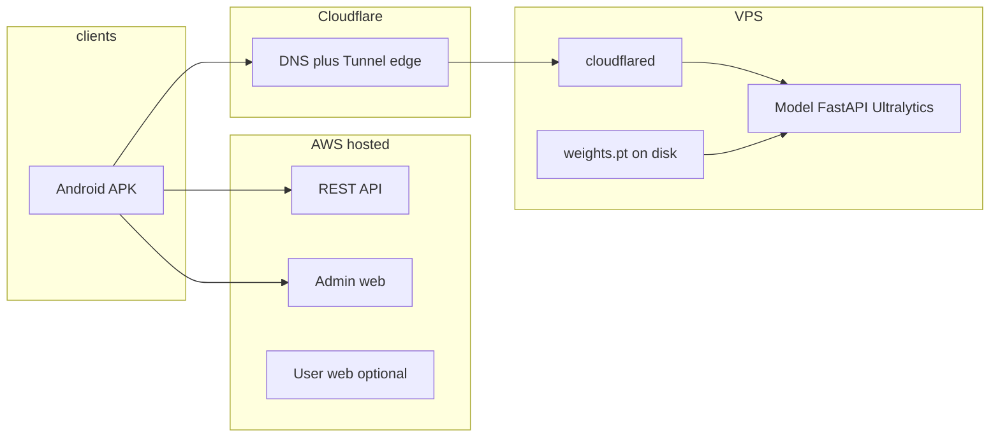

# PRD: Mobile release, model on VPS (Cloudflare Tunnel), AWS stack, admin, and UAT

**Status:** Draft operational plan  
**Audience:** Engineering, ops, and 2–3 UAT participants  
**Includes:** §2 **Scope of work** (deliverables, roles, assumptions, acceptance milestones); §14 **Work tickets** (copy-ready for GitHub/Jira); §16 **GitHub Actions & AWS deployment roles** (Baseline CI/CD OIDC).  
**Related docs:** [expo-go-tunnel-and-android-apk.md](./expo-go-tunnel-and-android-apk.md), [vps-e2e-deployment.md](./vps-e2e-deployment.md)

---

## 1. Summary and goals

Deliver a **production-like path** where:

1. **Android** ships as an **installable APK** built with **Expo Application Services (EAS Build)** (not only Expo Go or web).
2. Environment and service URLs are **correct and predictable** in release builds (fixing “web has env, APK does not”).
3. The **detection model** runs on a **hired VPS**, with `**weights.pt` on disk** (not in Git), exposed to the internet via **Cloudflare Tunnel** and a hostname on a domain whose **nameservers point to Cloudflare** (e.g. domain from **GitHub Student Pack** or any registrar).
4. **API, admin, and web** remain on **AWS** as today. API changes deploy to AWS when features require it; some work (e.g. admin-only config) is **optional** for a minimal mobile + model cut.
5. **Admin** is improved so operators can manage mobile-oriented settings and support UAT without rebuilding the app for every URL change.
6. **UAT** runs with **2–3 real users** against a written test list and clear exit criteria.

---

## 2. Scope of work

This section is the **contract-style scope**: what will be delivered, under what assumptions, who is accountable, and how completion is accepted.

### 2.1 Purpose

Deliver a **pilot-ready** slice of the product: **EAS-built Android APK**, **model inference on a hired VPS** fronted by **Cloudflare Tunnel** and **your domain on Cloudflare**, **existing AWS-hosted API and admin** (deploy when code requires it), **admin improvements** to operate mobile-facing config and validate connectivity, plus **internal QA** and **UAT with 2–3 external or semi-external testers**.

### 2.2 In scope — deliverables

| Workstream        | Deliverable                                                                                                                                                                                                                                                   | Done when                                                                                                                                        |
| ----------------- | ------------------------------------------------------------------------------------------------------------------------------------------------------------------------------------------------------------------------------------------------------------- | ------------------------------------------------------------------------------------------------------------------------------------------------ |
| **Mobile / EAS**  | Android **APK** from EAS using an APK profile (e.g. `staging`, `production-apk` in `apps/mobile/eas.json`).                                                                                                                                                   | APK installs on real devices; no dependency on Expo Go for the pilot path.                                                                       |
| **Mobile / EAS**  | **Build-time configuration** documented and applied: all required `EXPO_PUBLIC_*` variables set in **Expo (EAS) environment variables / secrets** (not only a local `.env`).                                                                                  | A second engineer can reproduce a good build from this doc + Expo settings.                                                                      |
| **VPS / model**   | `**weights.pt`** on the server (secure copy; never committed to Git); model service running (Docker per repo or equivalent); `MODEL_PATH`, `API_KEY`, bind address documented.                                                                                | Public or VPN-only smoke: `/health` shows model loaded; `/detect` works with `X-API-Key` as in [vps-e2e-deployment.md](./vps-e2e-deployment.md). |
| **Cloudflare**    | `**cloudflared` tunnel** with a public hostname (e.g. `detect.<domain>`) to the model’s local port; **DNS** under a zone on Cloudflare; **registrar nameservers** pointed to Cloudflare (domain via **GitHub Student Pack** or any registrar—same procedure). | `https://detect.<domain>/health` succeeds from the internet; matches mobile `EXPO_PUBLIC_DETECT_API_URL` (no trailing slash).                    |
| **AWS**           | **Production** API + Cognito behavior unchanged except where intentionally updated; **admin** and **API** deployed to AWS **when** merged code or config requires it (optional for a “env-only” pilot, required for AD* UI).                                  | Mobile can authenticate and load `/app-config/user/mobile` when that path is part of the pilot.                                                  |
| **Admin**         | Prioritized backlog **§5.4** (AD1–AD5): mobile config UX, health/test from admin, status and audit as agreed, links to runbooks.                                                                                                                              | Operators can update mobile-visible settings and validate AWS→model connectivity **before** UAT; artifacts deployed to your AWS admin host.      |
| **Quality**       | **Internal QA** (§9.1); **UAT** with **2–3 users** using §9.2; defects logged with severity.                                                                                                                                                                  | Internal sign-off recorded; UAT satisfies **exit criteria** in §9.2 or documented waivers signed by product owner.                               |
| **Documentation** | This PRD maintained as the umbrella; pointers to [expo-go-tunnel-and-android-apk.md](./expo-go-tunnel-and-android-apk.md) and [vps-e2e-deployment.md](./vps-e2e-deployment.md); optional short “lesson learned” addendum after UAT.                           | Handoff does not rely on oral tradition only.                                                                                                    |

### 2.3 Explicitly out of scope

Anything listed in **§11** stays excluded unless formally expanded (e.g. Play Store production AAB, iOS TestFlight, on-device model). **Additional exclusions:**

- **24/7 operations** or on-call pager for VPS/Tunnel (best-effort monitoring only unless separately agreed).
- **New ML work**: collecting datasets, retraining, or replacing `weights.pt` (you **supply** the checkpoint; scope is deploy and run it).
- **Legal / store compliance** beyond what you need for a private APK sideload pilot (accessibility statement, Play policy review, etc.).
- **Guaranteed SLAs** for inference latency or uptime on consumer-grade VPS (targets can be measured in UAT, not contractually guaranteed here).

### 2.4 Roles and responsibilities

| Role                        | Responsibility                                                                                                                          |
| --------------------------- | --------------------------------------------------------------------------------------------------------------------------------------- |
| **Engineering / tech lead** | Sequencing workstreams, go/no-go for UAT, approval of production config.                                                                |
| **Infra / backend**         | VPS baseline, Docker, Tunnel, DNS, firewall posture; AWS API/admin deploys when needed; secrets rotation procedure for model `API_KEY`. |
| **Mobile**                  | EAS profiles, env matrix, device verification, crash fixes blocking UAT.                                                                |
| **Admin / full-stack**      | AD* implementation and deployment; verifying admin “test” endpoints against the live model URL.                                         |
| **Product owner**           | UAT participant selection, definition of “safety-critical” for exit criteria, prioritization of post-UAT bugs.                          |
| **UAT participants (2–3)**  | Execute §9.2; provide scores and issue reports; no obligation to maintain infrastructure.                                               |

*(One person may cover multiple roles; the table still defines accountability.)*

### 2.5 Assumptions and dependencies

- **Accounts and access:** Expo (EAS), Cloudflare (Zero Trust / DNS as used), AWS deployment path, VPS SSH, registrar login for nameserver updates.
- **Artifacts:** Production-like `**weights.pt`**, alignment of **class IDs / names** with `apps/model` config (see [vps-e2e-deployment.md](./vps-e2e-deployment.md)).
- **Security posture:** Team accepts that values in `**EXPO_PUBLIC_*`** are recoverable from the bundle; model `**API_KEY**` is a practical gate, not equivalent to server-side-only secrets.
- **Calendar:** DNS propagation and first-time Tunnel bring-up may consume **hours** without blocking other tasks.
- **Features in UAT:** Maps, crossing, and Gemini are **in UAT scope only if** the pilot declares them mandatory (see §5.1 **M6**); otherwise they may be disabled or marked “not tested” in UAT notes.

### 2.6 Work packages (indicative effort)

| ID    | Package                                   | Notes                              | Indicative duration |
| ----- | ----------------------------------------- | ---------------------------------- | ------------------- |
| WP-M  | EAS env + APK + two-device smoke          | Parallel with VPS                  | 0.5–1.5 d           |
| WP-V  | VPS + `weights.pt` + Docker + local smoke |                                    | 0.5–1 d             |
| WP-CF | Tunnel + public DNS + external `curl`     | Depends on WP-V                    | 0.5–1 d             |
| WP-A  | Admin AD* + AWS deploy                    | Scales with how many AD items ship | 1–3 d               |
| WP-Q  | Internal QA (§9.1)                        |                                    | 1–2 d               |
| WP-U  | UAT facilitation + P0/P1 fixes            |                                    | 3–5 d               |

*(Ranges are estimates; merge WP-V and WP-CF if the same person executes back-to-back.)*

### 2.7 Acceptance milestones and sign-off

| Milestone                 | Criterion                                                                                                        |
| ------------------------- | ---------------------------------------------------------------------------------------------------------------- |
| **A — Model exposed**     | HTTPS URL responds; `/health` OK; key-gated `/detect` OK from outside the VPS.                                   |
| **B — Mobile integrated** | EAS APK on **two** distinct Android devices: sign-in + at least one successful detection round-trip to that URL. |
| **C — Admin operable**    | Agreed AD* items live; operator can update mobile config and run connectivity test from admin (if in scope).     |
| **D — UAT closed**        | §9.2 completed; exit criteria met or **written waivers** on file with product owner.                             |

**Formal sign-off:** Product owner (or delegate) acknowledges **Milestones A–D** and attaches build identifiers (EAS build ID, git SHA, model weight version or file hash optional).

---

## 3. Problem statement: why web “has env” but APK “does not”

Expo and Metro **inject `EXPO_PUBLIC_*` variables at bundle time**—they are compiled into the JavaScript bundle. They are **not** read from a magic file on the phone at runtime.

| Context                  | Where env comes from                                                                                                                                                                                                                                                                  |
| ------------------------ | ------------------------------------------------------------------------------------------------------------------------------------------------------------------------------------------------------------------------------------------------------------------------------------- |
| Local `expo start` / web | Often `apps/mobile/.env` (or shell) on your machine; Metro loads it during dev.                                                                                                                                                                                                       |
| **EAS Build (cloud)**    | The build runs on Expo’s builders. `**apps/mobile/.env` is not uploaded by default** and must not contain secrets you rely on leaking. You must supply variables via `**eas.json` → `env`**, **Expo Dashboard → Environment variables**, and/or `**eas secret:*`** per build profile. |

**Symptom:** Web or dev works because your laptop has `.env`; the APK built in the cloud gets **empty defaults** unless you configure EAS.

**Mitigation (use both layers):**

1. **Build-time:** Set every required `EXPO_PUBLIC_*` for the target profile (`staging`, `production-apk`, etc.) in EAS (see §6).
2. **Runtime (optional but recommended):** The app already calls `**GET /app-config/user/mobile`** (authenticated when possible) and merges with env fallbacks (`apps/mobile/src/lib/runtime-config.ts`). Storing URLs/keys (or URL-only; keys ideally not in Dynamo if you want stricter secrecy) in **admin-managed app config** reduces the need for a new APK when only endpoints change—**after** `EXPO_PUBLIC_API_URL` points to the real AWS API so the first fetch can succeed.

---

## 4. System context

- **Mobile → AWS API:** Auth (Cognito), profile, optional remote mobile config.
- **Mobile → model:** HTTPS to e.g. `https://detect.example.com` (Tunnel); must match `**EXPO_PUBLIC_DETECT_API_URL`** / admin mobile config `**detectApiBaseUrl**` (no trailing slash), and `**EXPO_PUBLIC_DETECT_API_KEY**` / `**detectApiKey**` aligned with `**API_KEY**` on the model (`vps-e2e-deployment.md`).

---

## 5. Product and technical requirements

### 5.1 Mobile (Must)

- **M1 — EAS Android APK:** Use an EAS profile that sets `"android": { "buildType": "apk" }"` (repo already defines e.g. `staging`, `production-apk` in `apps/mobile/eas.json`).
- **M2 — Documented env matrix:** Every variable needed for release is listed (§6) and set on EAS for the chosen profile.
- **M3 — API base URL:** `EXPO_PUBLIC_API_URL` must target the **production AWS API** (trailing slash as used by `api-client.ts`).
- **M4 — Cognito:** `EXPO_PUBLIC_COGNITO_USER_POOL_ID`, `EXPO_PUBLIC_COGNITO_CLIENT_ID`, `EXPO_PUBLIC_AWS_REGION` match the deployed user pool.
- **M5 — Detection:** `EXPO_PUBLIC_DETECT_API_URL`, `EXPO_PUBLIC_DETECT_API_KEY` match Tunnel hostname and model `.env`.
- **M6 — Optional services:** Crossing/transit URLs and keys (`EXPO_PUBLIC_CROSSING_API_*`), Maps (`EXPO_PUBLIC_GOOGLE_MAPS_API_KEY`), Gemini (`EXPO_PUBLIC_GOOGLE_AI_*`) as required by shipped features—**UAT checklist must declare which are mandatory** for the pilot.

### 5.2 Model on VPS + Cloudflare (Must)

- **V1:** `weights.pt` placed under `apps/model/weights/` on the VPS (or path set in model `MODEL_PATH`); never committed (`*.pt` in `.gitignore`).
- **V2:** Docker (or documented process) runs the model service on `127.0.0.1:8080` (or chosen port).
- **V3:** `cloudflared` tunnel publishes `**https://detect.<your-domain>/...`** to that local service; **DNS** for the subdomain is via Cloudflare (tunnel route or Zero Trust public hostname).
- **V4:** Domain **nameservers** at registrar point to **Cloudflare**; zone shows **Active**.
- **V5:** **TLS:** Clients use HTTPS; model `API_KEY` set; mobile sends `X-API-Key` where required.
- **V6:** **Firewall:** Prefer **no inbound 80/443** on VPS for the model path if only Tunnel is used; SSH restricted.

Detailed commands: [vps-e2e-deployment.md](./vps-e2e-deployment.md).

### 5.3 AWS API / Admin / Web (Should / Optional)

- **A1 (Should):** Production API URL stable and CORS/mobile-friendly as already deployed.
- **A2 (Optional for minimal path):** No API code change if mobile works with env + static app config in DB from a one-time seed—but **admin improvements** usually imply small API or admin-only deploys.
- **A3:** Any change that touches `**/app-config/user/mobile`** or admin CRUD requires **deploy API + admin** to AWS.

### 5.4 Admin improvements (Should — backlog for “fully functional” ops)

Prioritize items that unblock **env-less APK iterations** and **UAT observability**:

| ID  | Improvement                                                                                                                                                 | Rationale                                              |
| --- | ----------------------------------------------------------------------------------------------------------------------------------------------------------- | ------------------------------------------------------ |
| AD1 | **Mobile config screen:** clear fields for `detectApiBaseUrl`, keys, crossing URLs, Maps key, AI model; validation (URL format, no trailing slash warning). | Reduces mistaken configs during pilot.                 |
| AD2 | **Health / test actions:** use existing `POST .../mobile/health` and `POST .../mobile/test` from admin UI with visible response (latency, HTTP status).     | Confirms AWS → model path before asking users to test. |
| AD3 | **Detection / model status page:** link to health, last error, optional version/env display.                                                                | Faster triage during UAT.                              |
| AD4 | **Audit / read-only view:** who last updated mobile config and when (if not already present).                                                               | Accountability.                                        |
| AD5 | **Documentation link** in admin footer to this PRD or `vps-e2e-deployment.md`.                                                                              | Onboarding helpers.                                    |

Scope **admin** work to what the team can ship before UAT; mark cut-line explicitly in sprint planning.

---

## 6. Build configuration: `EXPO_PUBLIC_*` for EAS

**Source of truth in code:** `apps/mobile/src/lib/api-client.ts`, `apps/mobile/src/lib/runtime-config.ts`, `apps/mobile/.env.example` (extend example to include all keys used in production).

Minimum set for detection + AWS auth:

| Variable                           | Purpose                                                   |
| ---------------------------------- | --------------------------------------------------------- |
| `EXPO_PUBLIC_API_URL`              | Base URL for backend (e.g. `https://api.yourdomain.com/`) |
| `EXPO_PUBLIC_COGNITO_USER_POOL_ID` | Cognito pool                                              |
| `EXPO_PUBLIC_COGNITO_CLIENT_ID`    | App client                                                |
| `EXPO_PUBLIC_AWS_REGION`           | Region                                                    |
| `EXPO_PUBLIC_DETECT_API_URL`       | `https://detect.yourdomain.com` (no trailing slash)       |
| `EXPO_PUBLIC_DETECT_API_KEY`       | Matches model `API_KEY`                                   |

Additional if features are enabled:

| Variable                                                        | Purpose          |
| --------------------------------------------------------------- | ---------------- |
| `EXPO_PUBLIC_CROSSING_API_URL` / `EXPO_PUBLIC_CROSSING_API_KEY` | Crossing service |
| `EXPO_PUBLIC_GOOGLE_MAPS_API_KEY`                               | Maps             |
| `EXPO_PUBLIC_GOOGLE_AI_API_KEY` / `EXPO_PUBLIC_GOOGLE_AI_MODEL` | Gemini           |

**EAS procedures (pick one or combine):**

1. Expo website: **Project → Environment variables** → assign to **preview / production** as needed.
2. `eas.json` per profile: `"env": { "EXPO_PUBLIC_API_URL": "..." }` (non-secret URLs only; avoid committing secrets if repo is shared).
3. `eas secret:create` for sensitive values, reference from build.

**Verification:** After build, unzip or use a staging artifact check: grep is not trivial on APK; preferred is **instrumented staging build** logging “config loaded” once, or **admin test endpoint** hitting model with same key as mobile.

---

## 7. Domain and GitHub Student Pack

Typical flow:

1. Claim student domain benefit (provider depends on **GitHub Student Pack** partner at signup time—e.g. Namecheap; follow current GitHub Education docs).
2. Register domain; in registrar, set **nameservers** to those Cloudflare assigns when you **Add site**.
3. Wait for Cloudflare zone **Active**.
4. Create Tunnel, add public hostname `detect.<domain>` → `http://127.0.0.1:8080` on VPS.
5. Optional: `**api.` / `admin.`** stay on AWS (Route 53 + CloudFront/ALB, etc.)—do not move them unless DNS plan is unified.

---

## 8. Deployment plan (phased)

### Phase 0 — Prerequisites (½–1 day)

- Expo account, EAS CLI, `eas login`, project linked (`apps/mobile`).
- AWS production URLs and Cognito IDs confirmed.
- VPS SSH, Docker, `cloudflared` installed; domain on Cloudflare.

### Phase 1 — Model on VPS (½–2 days)

- Copy `weights.pt`; configure `apps/model/.env`; `docker compose up -d`.
- Local smoke: `curl` `/health`, `/detect` with API key ([vps-e2e-deployment.md](./vps-e2e-deployment.md)).
- Tunnel + DNS; external smoke: `curl` from laptop via `https://detect...`.

### Phase 2 — Mobile EAS build (½ day)

- Set all `EXPO_PUBLIC_*` on EAS for `staging` or `production-apk`.
- `eas build -p android --profile staging` (or chosen profile).
- Install APK; sign-in; confirm detection hits Tunnel URL (Charles/Flipper/mitmproxy optional).

### Phase 3 — Admin + optional API deploy (1–3 days)

- Implement AD1–AD5 as agreed; seed or set mobile config in production.
- Deploy admin + API to AWS if code changed.

### Phase 4 — Internal QA (1–2 days)

- Run **Internal test list** (§9.1) on 1–2 team devices.

### Phase 5 — UAT (3–5 days)

- Onboard **2–3 UAT users**; share **UAT script** (§9.2); collect issues in a single tracker (GitHub Issues / Linear).

### Phase 6 — Hardening and sign-off

- Fix P0/P1; decide Play Store / AAB timeline (out of scope for this APK pilot).

---

## 9. Testing

### 9.1 Internal QA checklist (engineering)

**Auth and API**

- Sign up, confirm email (if configured), sign in, sign out.
- Token refresh after backgrounding app (spot check).

**Detection**

- Camera permission; live preview runs.
- Detection request reaches `EXPO_PUBLIC_DETECT_API_URL`; 200 response; overlays match expectations in good light.
- Invalid API key returns expected error path (no crash).
- Airplane mode / timeout: user-visible error, no hang.

**Config layering**

- With only EAS env (no server override): detection works.
- With admin mobile config set: app still works after kill/restart (cached config behavior understood—document if cache clear is needed).

**Navigation / maps (if in scope)**

- Location permission; map loads; routing smoke test.

**Crossing / transit (if in scope)**

- Endpoints and keys correct; banners or UI behave as designed.

**Performance / stability**

- 10+ minute session without OOM; device warm; battery note for UAT users.

### 9.2 UAT script (2–3 users)

**Before session**

- Install APK (or internal track link); confirm version/build number visible (add to **Settings** if missing—nice-to-have).
- Confirm test **Cognito** account or invite flow.

**During session (60–90 min suggested)**

1. **Onboarding:** First launch, permissions, any tutorial.
2. **Core journey:** Open detect → point at **static** scene with known objects → confirm audio/haptic/visual if applicable.
3. **Real world:** Short **outdoor** walk (5–10 min)—lighting change, distance.
4. **Failure recovery:** Toggle airplane mode 30s, restore; expect graceful message.
5. **Subjective:** SUS-style 3 questions: “I trust the alerts,” “Speed felt acceptable,” “I’d use this for a real trip” (1–5).

**Exit criteria for UAT pass**

- No **P0** crashes; no undetected **safety-critical** false negative agreed with product (define what “critical” means for your model).
- **≤2 P1** issues acceptable if documented and scheduled.
- **2 of 3** users rate core journey **4/5** or higher on a simple scale.

---

## 10. Risks and mitigations

| Risk                                                | Mitigation                                                                                                                  |
| --------------------------------------------------- | --------------------------------------------------------------------------------------------------------------------------- |
| Secrets in `EXPO_PUBLIC_`* are extractable from APK | Treat model key as **obfuscation**; rate-limit and monitor at Tunnel/model; rotate keys; consider short-lived tokens later. |
| Tunnel or VPS down                                  | Health checks; Cloudflare + VPS monitoring; status comms to UAT users.                                                      |
| Class names / model mismatch                        | Align `apps/model` config with trained classes ([vps-e2e-deployment.md](./vps-e2e-deployment.md) §10).                      |
| Cognito app client misconfig on mobile              | Verify callback URLs / sign-in URIs for **native** client type.                                                             |

---

## 11. Out of scope (for this PRD)

- Google Play production AAB, store listing, and Play Console phased rollout (track as follow-up).
- iOS TestFlight (same EAS env lessons apply).
- On-device model inference (all server-side for this plan).

---

## 12. Success metrics

- **Technical:** One **EAS-built APK** that works against **AWS API** and **Tunnel-backed model** with no manual `adb`-injected env.
- **Operational:** Admin can update mobile-visible endpoints (within limits of §3) without emergency rebuilds where server config applies.
- **UAT:** **2–3 users** complete §9.2 with **exit criteria** met.

---

## 13. Action items checklist (copy to issue tracker)

- Extend `apps/mobile/.env.example` with all `EXPO_PUBLIC_`* used in production.
- Configure EAS environment variables for chosen Android profile.
- VPS: weights + Docker + tunnel + DNS smoke tests.
- AWS: confirm `EXPO_PUBLIC_API_URL` and Cognito match deployment.
- Admin: ship prioritized AD* items + deploy.
- Run internal QA then UAT; file and triage bugs.

---

## 14. Work tickets (copy-ready)

Use one **GitHub Issue** or **Jira ticket** per block below (or merge/split to match your sprint size). Suggested labels: `infra`, `mobile`, `admin`, `qa`, `cloudflare`, `vps`.

---

### Ticket MOB-001 — EAS Android APK with correct `EXPO_PUBLIC_`* on cloud builds

**Type:** Task · **Priority:** P0

**Title:** Configure EAS env + produce pilot Android APK

**Description:**  
Release builds on EAS do not read local `apps/mobile/.env`. All variables required at bundle time must be set in Expo (Dashboard and/or secrets / `eas.json`) so the APK reaches production AWS API, Cognito, and the Tunnel model URL. Deliver a downloadable APK from a defined profile (`staging` or `production-apk` per `apps/mobile/eas.json`).

**Investigation / existing infra:**

- Profiles in `apps/mobile/eas.json`: `staging` (APK), `production-apk`, `preview`, `production`, `development`.
- Client usage: `apps/mobile/src/lib/api-client.ts` (`EXPO_PUBLIC_API_URL`), `apps/mobile/src/lib/runtime-config.ts` (`EXPO_PUBLIC_DETECT_`*, crossing, Maps, Gemini fallbacks).
- Reference list: `apps/mobile/.env.example` and §6 of this doc.
- Remote config path: `GET /app-config/user/mobile` still requires a working `EXPO_PUBLIC_API_URL` for first fetch.

**Acceptance criteria:**

- Every variable in §6 **Minimum set** is set for the chosen EAS profile (and any **Additional** vars required for the pilot scope per §5.1 **M6**).
- `eas build -p android --profile <name>` completes; **EAS build ID** recorded in the ticket.
- APK installs on **two** physical devices; user can sign in and run **at least one** detection request against the agreed `EXPO_PUBLIC_DETECT_API_URL` without adb env injection.
- Short note in ticket or wiki: where each secret lives (Expo secret name vs Dashboard only—no secret values in plaintext in the issue).

---

### Ticket INF-002 — VPS model service: `weights.pt`, Docker, health/detect smoke

**Type:** Task · **Priority:** P0

**Title:** Deploy model on VPS with weights on disk (not in Git)

**Description:**  
Run the FastAPI + Ultralytics model from this repo on the hired VPS. Place `weights.pt` on the server securely. Expose the process on localhost for a later Tunnel hop. Document `MODEL_PATH`, `API_KEY`, and restart procedure.

**Investigation / existing infra:**

- Compose and ports: `apps/model/docker-compose.yml`; default `PORT=8080`; mount `./weights:/app/weights:ro`.
- Env template: `apps/model/.env.example`; runtime checks `X-API-Key` when `API_KEY` is set (`apps/model` API code).
- Git never stores `*.pt`: root `.gitignore`.
- Full steps: [vps-e2e-deployment.md](./vps-e2e-deployment.md) §§2–5.

**Acceptance criteria:**

- `weights.pt` present at the path referenced by `MODEL_PATH`; file **not** committed.
- `docker compose up -d` (from `apps/model`) yields `200` on `GET http://127.0.0.1:8080/health` from the VPS shell; `model_loaded` true when applicable.
- `POST /detect` succeeds with valid `X-API-Key` and small test payload (per VPS doc §5).
- `ufw` or equivalent: **SSH allowed**; inbound **80/443 optional** if using Tunnel only (document actual choice).

---

### Ticket INF-003 — Cloudflare Tunnel + DNS for model hostname

**Type:** Task · **Priority:** P0  
**Depends on:** INF-002

**Title:** Expose model via Cloudflare Tunnel (`detect.<domain>`)

**Description:**  
Publish the VPS model service at a stable **HTTPS** hostname using `cloudflared`. Domain zone must be **Active** on Cloudflare with registrar nameservers pointing to Cloudflare (GitHub Student Pack domain is fine).

**Investigation / existing infra:**

- Ingress pattern and DNS routing: [vps-e2e-deployment.md](./vps-e2e-deployment.md) §§7–8.
- Mobile expects **HTTPS** and base URL **without trailing slash** (`EXPO_PUBLIC_DETECT_API_URL`).
- Optional: same tunnel file can host multiple hostnames later (`api.`, `app.`)—out of scope unless AWS DNS is unified.

**Acceptance criteria:**

- From **outside** the VPS (e.g. engineer laptop), `curl -sS https://detect.<your-domain>/health` returns success.
- `POST https://detect.<your-domain>/detect` works with the same `X-API-Key` as the model container.
- Tunnel runs as a **persistent service** (e.g. systemd) so it survives reboot; link to Cloudflare doc or internal runbook in ticket.
- Hostname and port mapping recorded in ticket for MOB-001 / admin mobile config.

---

### Ticket AWS-004 — Confirm production API + Cognito match mobile pilot (deploy optional)

**Type:** Task · **Priority:** P1

**Title:** Align mobile build with deployed AWS API and Cognito app client

**Description:**  
Ensure `EXPO_PUBLIC_API_URL`, pool ID, client ID, and region match the **live** AWS environment. Deploy API/admin only if verification requires code or config changes.

**Investigation / existing infra:**

- Mobile: `apps/mobile/src/lib/api-client.ts`, `apps/mobile/src/lib/amplify.ts` (if present), auth screens under `apps/mobile/app/(auth)/`.
- Backend mobile config: `GET /app-config/user/mobile`, admin routes under `apps/api/src/baseblocks/app-config/` (`app-config-user-api.ts`, `app-config-admin-api.ts`).
- Infra: CDK or existing deploy pipeline for `apps/api`, `apps/admin` (e.g. `apps/infra/`).

**Acceptance criteria:**

- Document in ticket: production `EXPO_PUBLIC_API_URL`, user pool id, client id, region (redact if pasted in public tracker—use secure note).
- Authenticated call from a **staging APK** to `/app-config/user/mobile` returns expected JSON or documented empty defaults.
- If code or Dynamo/Cognito settings changed: **deploy completed** and smoke test passes; revision / commit SHA linked.
- **Cognito app client** type and sign-in configuration verified for native mobile (no web-only redirect mismatch).

---

### Ticket ADM-005 — Admin: mobile runtime config UX + validation (§5.4 AD1)

**Type:** Story · **Priority:** P1  
**Depends on:** AWS-004 (for end-to-end test against prod-like API)

**Title:** Polish admin UI for mobile app config (URLs, keys, validation)

**Description:**  
Reduce misconfiguration during pilot: clear fields aligned with `MobileRuntimeConfig` / API payloads, sensible validation (e.g. detect base URL format, trailing-slash warning).

**Investigation / existing infra:**

- Admin app: `apps/admin/src/baseblocks/app-config/pages/AppConfig.tsx` (extend or split UI as needed).
- API types: `packages/types/app-config.d.ts`; client helpers `packages/client-api/app-config.ts`.
- Server merge logic: `apps/api/src/baseblocks/app-config/app-config.ts`.

**Acceptance criteria:**

- Admin can read and update all mobile-config fields exposed by API (URLs, optional keys per product decision).
- Inline validation catches obvious errors before save (malformed URL, trailing slash on detect base URL where forbidden).
- After save, a **logged-in mobile app** picks up merged config after documented refresh path (cold start vs cache—document behavior).

---

### Ticket ADM-006 — Admin: model health/test actions from UI (§5.4 AD2)

**Type:** Story · **Priority:** P1  
**Depends on:** ADM-005, INF-003

**Title:** Surface `POST …/mobile/health` and `POST …/mobile/test` in admin with visible results

**Description:**  
Operators should confirm **API → model** connectivity without Postman. Wire existing admin endpoints to the UI and show HTTP status, latency, and error body snippet.

**Investigation / existing infra:**

- `apps/api/src/baseblocks/app-config/app-config-admin-api.ts`: routes `…/mobile/health`, `…/mobile/test`.
- `packages/client-api/app-config.ts`: client methods if already defined.

**Acceptance criteria:**

- Buttons or actions in admin trigger both endpoints; results visible (success/failure, timing).
- Failure cases show actionable message (e.g. TLS error, 401 wrong key, timeout).
- Screenshot or short Loom linked in ticket (optional) for handoff.

---

### Ticket ADM-007 — Admin: detection status + audit + doc links (§5.4 AD3–AD5)

**Type:** Story · **Priority:** P2

**Title:** Model status view, config audit metadata, runbook links

**Description:**  
Improve UAT support: link to health, show last known error or version if available, who/when last changed mobile config, footer link to this PRD or `vps-e2e-deployment.md`.

**Investigation / existing infra:**

- What the API already returns for app-config history (if any); may require small API change—then pair with **AWS-004** deploy.
- Admin layout: shared footer or settings page.

**Acceptance criteria:**

- **AD3:** Single place in admin for “detection / model” operational context (health link or embedded status—scope as feasible without large API work).
- **AD4:** If API stores editor metadata, display it; if not, ticket documents “not available” and optional follow-up spike.
- **AD5:** Link to `docs/mobile-deployment-prd-and-uat.md` and/or `docs/vps-e2e-deployment.md` from admin.

---

### Ticket QA-008 — Internal QA execution (§9.1)

**Type:** Task · **Priority:** P1  
**Depends on:** MOB-001, INF-003, AWS-004

**Title:** Run internal QA checklist before UAT

**Description:**  
Execute §9.1 on 1–2 team-owned devices. File bugs for P0/P1. Record build ID and model URL in the ticket.

**Investigation / existing infra:**

- Checklist: §9.1 in this doc.
- Bug tracker: GitHub Issues / Linear (team convention).

**Acceptance criteria:**

- All §9.1 rows **checked** or explicitly **N/A** with reason (e.g. crossing not in pilot).
- P0 count = 0 before inviting UAT users.
- Link to test notes or spreadsheet in ticket.

---

### Ticket QA-009 — UAT with 2–3 users (§9.2)

**Type:** Task · **Priority:** P1  
**Depends on:** QA-008

**Title:** User acceptance testing — 2–3 participants

**Description:**  
Onboard external or semi-external testers. Share APK install steps and §9.2 script. Collect subjective scores and issues.

**Investigation / existing infra:**

- UAT script and exit criteria: §9.2.
- Consent / data handling: team responsibility (not specified in this doc).

**Acceptance criteria:**

- **2–3** users complete the session; feedback captured (form or issues).
- **Exit criteria** in §9.2 evaluated; document pass/fail or **waivers** from product owner.
- Summary comment: top issues, next steps (Play Store, iOS, etc.).

---

### Ticket DOC-010 — Post-pilot runbook touch-up (optional)

**Type:** Chore · **Priority:** P3

**Title:** Update deployment docs from pilot lessons learned

**Description:**  
After INF/MOB work, add one screen’s worth of “what we actually did” (tunnel name, EAS profile, exact env var list) to `docs/` or internal wiki so the next deploy is faster.

**Acceptance criteria:**

- Links from this PRD or VPS doc to the addendum.
- No secrets in committed markdown (use placeholders).

---

## 15. Next steps — Expo owner `capstoneuow`

`apps/mobile/app.json` **`owner`** must match the Expo account or organization that owns the project (set to **`capstoneuow`**).

### 15.1 Link the repo to the new Expo project

EAS **`projectId`** in `app.json` → `extra.eas.projectId` is tied to a specific Expo project. After changing **owner**:

1. Log into [expo.dev](https://expo.dev) as **`capstoneuow`** (or a member of that account).
2. Create or select the **`ai-detect`** app (slug must align with `app.json` **`slug`** unless you intentionally rename and update slug everywhere).
3. From `apps/mobile`, run `eas whoami`, then **`eas init`** / follow prompts to associate this repo with that project—or use **transfer project** in the Expo dashboard from the old account if you move ownership instead of starting fresh.

If you start a **new** project under `capstoneuow`, **`extra.eas.projectId`** in `apps/mobile/app.json` will update when you complete `eas init` (accept the overwrite when prompted).

### 15.2 Copy secrets / environment variables to the new account

Expo **does not migrate** Dashboard env vars or EAS Secrets between unrelated accounts—you must recreate them.

**Recreate under the `capstoneuow` project** (mirror the old account):

| Kind | Where in Expo | What to copy |
|------|----------------|----------------|
| **EAS environment variables** | Project → Environment variables (`production`, `preview`, `development` as needed) | All **`EXPO_PUBLIC_*`** keys from §6 (API URL, Cognito, detect URL/key, Maps, Gemini, crossing, etc.). |
| **EAS Secrets** | `eas secret:create` or Dashboard equivalents | Anything referenced by build profiles **not** stored in plain Dashboard env (e.g. sensitive keys). |
| **Credential JSON / keystores** | EAS-managed or local | Android: if you rely on credentials created under the **old** account, **download or re-create** keystores/play credentials under the **new** EAS credentials store for this project; signing must be consistent across stores you care about (see [credentials](https://docs.expo.dev/app-signing/app-credentials/) if you regenerate). |

**Do not rely on Git:** `.env`, `eas.json`-embedded secrets from the old checkout, or private keys belong only in Expo or a vault—copy values from your **secure password manager** / old-account Expo UI, never from ticket text.

### 15.3 Quick verification

- [ ] `eas whoami` shows the intended user/org.
- [ ] `eas build:list -p android` works for the **`capstoneuow`** project without “project not found”.
- [ ] A **`eas build -p android --profile staging`** completes; install APK and smoke-test auth + detection.

---

## 16. GitHub Actions CI/CD and AWS deployment role (Baseline)

This project uses **OIDC federation** so GitHub Actions can call AWS **without long-lived access keys**. Baseline documents the operational model and security expectations here:

- [Main Operations — Deploy](https://docs.baselinejs.com/Main%20Operations/deploy) — CI/CD as part of the Baseline delivery story; align local and pipeline deploys (`pnpm`/CDK) with staged environments.
- [Main Concepts — Security — Deployment role](https://docs.baselinejs.com/Main%20Concepts/security#deployment-role) — use a **dedicated deployment IAM role** for automation (narrow trust to your repo/workflows; avoid reusing human admin credentials).

Treat those pages as the **intent**; the **concrete wiring in this repo** is below.

### 16.1 How this repository implements CI/CD authentication

| Piece | Location / behavior |
|--------|---------------------|
| **OIDC token** | Workflows set `permissions:` `id-token: write` so `aws-actions/configure-aws-credentials` can exchange the GitHub JWT for STS credentials ([GitHub OIDC on AWS](https://docs.github.com/en/actions/deployment/security-hardening-your-deployments/configuring-openid-connect-in-amazon-web-services)). |
| **Role selection** | Composite action `.github/actions/ci-setup/action.yml`: if `github.ref` is `refs/heads/prod`, assume **`PRODUCTION_AWS_ROLE_ARN`**; otherwise assume **`STAGING_AWS_ROLE_ARN`**. |
| **When AWS is used** | `configure_aws: 'true'` (default): typecheck/build/lint, admin+web `generate:env:*` + build, and CDK `deploy:*`. `deploy-api` uses `configure_aws: 'false'` (API build only—no CloudFormation at build time). |
| **Deploy workflow** | `.github/workflows/deploy.yml`: **main** → `deploy:staging`; **prod** → `deploy:prod` (see `deploy-infra` job). |
| **Secrets (GitHub)** | Repository **Actions secrets**: `STAGING_AWS_ROLE_ARN`, `PRODUCTION_AWS_ROLE_ARN` — must be the ARNs of IAM roles in the **target AWS account(s)** whose trust policy allows this repo to assume them via OIDC. |

### 16.2 AWS account work: OIDC provider + deployment roles

**One-time (per AWS account, if not already present):** add the **IAM OIDC identity provider** for GitHub:

- Provider URL: `https://token.actions.githubusercontent.com`
- Audience: `sts.amazonaws.com`

**Two IAM roles** (recommended pattern for this monorepo):

1. **Staging deployment role** (e.g. used for `main` and non-`prod` refs, including PRs that run `generate:env:staging` and builds).
2. **Production deployment role** (e.g. used only when `github.ref == refs/heads/prod`).

For each role, set a **trust policy** that:

- Principal: the GitHub OIDC provider above.
- Action: `sts:AssumeRoleWithWebIdentity`.
- **Conditions** (tighten per Baseline security guidance): restrict `token.actions.githubusercontent.com:sub` to your repository, e.g. `repo:ORG/REPO:*` or finer (`ref:refs/heads/main`, `ref:refs/heads/prod`, `pull_request`) so random workflows cannot assume the role.

**Permissions (attachment):** the role must be able to run **CDK deploy** for this app (CloudFormation, Lambda, API Gateway, S3, CloudFront, Cognito, DynamoDB, IAM resources created by stacks, etc.). Baseline’s **deployment role** concept is to grant what **deploy automation** needs—often `AdministratorAccess` in a dedicated account for small teams, or a **scoped policy** derived from least-privilege analysis. Start from Baseline’s recommended posture in [Security — Deployment role](https://docs.baselinejs.com/Main%20Concepts/security#deployment-role) and your org’s policy.

After roles exist, copy each **role ARN** into GitHub **Actions secrets** (`STAGING_AWS_ROLE_ARN`, `PRODUCTION_AWS_ROLE_ARN`).

### 16.3 Verification checklist

- [ ] `aws sts get-caller-identity` succeeds in a workflow step after `ci-setup` (already asserted in `.github/actions/ci-setup/action.yml` when `configure_aws` is true).
- [ ] A push to **`main`** completes **staging** infra deploy where intended; **`prod`** branch uses the **production** role and **prod** CDK stage.
- [ ] **Fork PRs:** if you must block untrusted OIDC assumptions, tighten trust conditions ([GitHub: OIDC hardened config](https://docs.github.com/en/actions/deployment/security-hardening-your-deployments/about-security-hardening-with-openid-connect)) so forked PR workflows cannot assume production roles.

### 16.4 PR / ticket text (optional copy-paste)

**Title:** Provision GitHub Actions OIDC + staging/prod deployment IAM roles  

**Description:** Implement Baseline-aligned GitHub Actions → AWS OIDC per [Deploy](https://docs.baselinejs.com/Main%20Operations/deploy) and [Security — Deployment role](https://docs.baselinejs.com/Main%20Concepts/security#deployment-role). Wire role ARNs to `STAGING_AWS_ROLE_ARN` and `PRODUCTION_AWS_ROLE_ARN`; confirm `.github/workflows/deploy.yml` staging/prod branching.

**Acceptance criteria:**

- [ ] OIDC IdP exists; two roles trusted for this repo/subjects as agreed.
- [ ] GitHub secrets set; **`Deploy`** workflow green on **`main`** and **`prod`** (or documented dry-run path).
- [ ] Trust policies documented in internal wiki (no secrets)—link to §16.2.

---

*Document owner: engineering. Update dates and status in your PR template when this moves from draft to approved.*